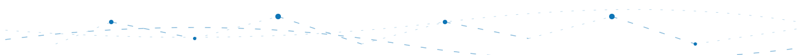

  
  

  
 
 

  

 <!-- TODO: fix this -->
  
### 👨‍💻 About Me

- 🔭 I’m currently architecting solutions at the intersection of **Mathematics and Computer Science**
- 🌱 I’m currently deepening my proficiency in **Quantitative Analysis, Algorithms, and System Security**
- 👯 I’m looking to collaborate on **interdisciplinary research and technical innovation**
- 💬 Ask me about **the convergence of creative arts and rigorous logic**
- ⚡ Fun fact: **Synthesizing code since age 5**

  

<table>
  <tr>
    <td valign="top">

### 🚀 Languages & Tools

 

</td>
    <td valign="top">

### 📊 GitHub Stats

   

     
   

   </td>
  </tr>
</table>

 

  <h3>🏆 Distinguished Projects (Jugend Forscht)</h3>

  

    <table width="100%" style="border: none;">
      <tr>
        <td align="center" style="border: none;">
          <h3>
            <a href="https://github.com/victor-gurbani/jufo2026" target="_blank">
              🎹 Computational Musicology & Stylistic Embeddings (2026)
            </a>
          </h3>
          

            
            
          

          

            A computational analysis pipeline quantifying musical style across the Baroque, Classical, and Romantic eras.
            Processes <strong>36 features</strong> to create a high-dimensional space where compositions can be mathematically compared.
          

          

            
            
            
            
          

        </td>
      </tr>
    </table>
  

  <table width="100%">
    <tr>
      <td width="33%" align="center" valign="top">
        <strong>Digital School Access (2025)</strong>
          
        
         
        
Full-stack biometric security ecosystem replacing physical keys with AI verification.

        
        
        
      </td>
      <td width="33%" align="center" valign="top">
        <strong>Smart Environment Control (2024)</strong>
          
        
         
        
Distributed IoT network optimizing classroom ventilation and lighting using Neural Networks.

        
        
        
      </td>
      <td width="33%" align="center" valign="top">
        <strong>iCane Mobility Ecosystem (2021)</strong>
          
        
         
        
Haptic virtual mobility aid for the visually impaired with GPS safety integration.

        
        
        
      </td>
    </tr>
  </table>

 

  ### 🚀 Tech Stack

<table>
  <tr>
    <td valign="top" width="33%">
      <h4 align="center">🧠 AI & Data Science</h4>
      

        
        
        
        
        
        
        
      

    </td>
    <td valign="top" width="33%">
      <h4 align="center">🎨 Frontend</h4>
      

        
        
        
        
        
      

    </td>
    <td valign="top" width="33%">
      <h4 align="center">⚙️ Backend & DB</h4>
      

        
        
        
        
        
        
      

    </td>
  </tr>
  <tr>
    <td valign="top" width="33%">
      <h4 align="center">🛠️ Systems & Tools</h4>
      

        
        
        
        
        
        
      

    </td>
    <td valign="top" width="33%">
      <h4 align="center">🤖 IoT & Automation</h4>
      

        
        
        
        
      

    </td>
    <td valign="top" width="33%">
      <h4 align="center">🖌️ Creative & Design</h4>
      

        
        
        
      

    </td>
  </tr>

  <tr>
    <td colspan="3" align="center">
      <h4 align="center">🌍 Spoken Languages</h4>
      

        
        &nbsp;&nbsp;
        
        &nbsp;&nbsp;
        
        &nbsp;&nbsp;
        
      

    </td>
  </tr>
</table>
 

<h3>🔗 Connect with me</h3>
  

 

  <h3>Support</h3>
  

<!-- ### GitHub Streak
  -->

<picture>
  <source media="(prefers-color-scheme: dark)" srcset="./profile/github-snake-dark.svg" />
  <source media="(prefers-color-scheme: light)" srcset="./profile/github-snake.svg" />
  
</picture>
  

  
