# Hi there, I'm Victor! 

<h3>𝐿𝑜𝑔𝑖𝑐 𝑤𝑖𝑡ℎ𝑖𝑛 𝑎𝑟𝑡, 𝑎𝑟𝑡 𝑤𝑖𝑡ℎ𝑖𝑛 𝑙𝑜𝑔𝑖𝑐.</h3>

 
 

<table>
  <tr>
    <td valign="top" width="55%">

### 👨‍💻 About Me

- 🔭 I’m currently working on **many projects**
- 🌱 I’m currently deepening my knowledge about **what I know**
- 👯 I’m looking to collaborate on **innovative ideas**
- 💬 Ask me about **what we could work together**
- ⚡ Fun fact: **Started programming when I was 5 years old**

 

</td>
    <td valign="top" width="45%">

### 📊 GitHub Stats

   

     
   

   </td>
  </tr>
</table>

 

### 🚀 Languages & Tools

 
 

### 🚀 Tech Stack

<table>
  <tr>
    <td valign="top" width="33%">
      <h4 align="center">🧠 AI & Data Science</h4>
      

        
        
        
        
        
        
        
      

    </td>
    <td valign="top" width="33%">
      <h4 align="center">🎨 Frontend</h4>
      

        
        
        
        
        
      

    </td>
    <td valign="top" width="33%">
      <h4 align="center">⚙️ Backend & DB</h4>
      

        
        
        
        
        
        
      

    </td>
  </tr>
  <tr>
    <td valign="top" width="33%">
      <h4 align="center">🛠️ Systems & Tools</h4>
      

        
        
        
        
        
        
      

    </td>
    <td valign="top" width="33%">
      <h4 align="center">🤖 IoT & Automation</h4>
      

        
        
        
        
      

    </td>
    <td valign="top" width="33%">
      <h4 align="center">🖌️ Creative & Design</h4>
      

        
        
        
      

    </td>
  </tr>

  <tr>
    <td colspan="3" align="center">
      <h4 align="center">🌍 Spoken Languages</h4>
      

        
        &nbsp;&nbsp;
        
        &nbsp;&nbsp;
        
        &nbsp;&nbsp;
        
      

    </td>
  </tr>
</table>

 
  

 

  <h3>Support</h3>
  

### GitHub Streak

<picture>
  <source media="(prefers-color-scheme: dark)" srcset="./profile/github-snake-dark.svg" />
  <source media="(prefers-color-scheme: light)" srcset="./profile/github-snake.svg" />
  
</picture>
  

